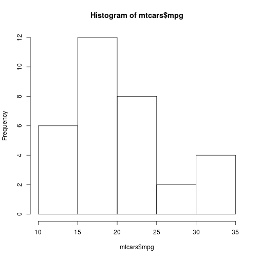

## Executive Summary

The following is an analysis of the effects of transmission on MPG using the mtcars data set provided by Motor Trend. We will explore the relationship between relevant variables and MPG. We are completing two objectives. 

* Is an automatic or manual transmission better for MPG?
* Quantify the MPG difference between automatic and manual transmissions

--- .class #id 
## About The MTCARS Dataset

The data was extracted from the 1974 Motor Trend US magazine, and comprises fuel consumption and 10 aspects of automobile design and performance for 32 automobiles (1973–74 models). Features include: MPG, Number of Cylinders, Displacement, Gross Horsepower, Rear Axle Ratio, Weight, Quarter Mile Time, VS, Transmission, Number of Gears, Number of Carburetors.

Henderson and Velleman (1981), Building multiple regression models interactively. Biometrics, 37, 391–411

--- .class #id 

## Viewing MTCARS Dataset

 

--- .class #id 

## The Prediction Function

  formulaTextPoint <- reactive({
    paste("mpg ~", "as.integer(", input$variable, ")")  })

  fit <- reactive({
    lm(as.formula(formulaTextPoint()), data=mpgData)  })
  ...
  output$fit <- renderPrint({
    summary(fit()) })

  output$mpgPlot <- renderPlot({
    with(mpgData, {
      plot(as.formula(formulaTextPoint()))
      abline(fit(), col=2)
    })  })

--- .class #id
## Conclusion

* Cars with Manual transmission get 1.8 MPG after adjusted by Cylinder, Horsepower and Weight  
* MPG appears to decrease marginally with an increase in Horsepower  
* MPG decreases by 2.5 after adjusted by Cylinder, Horsepower and Weight for ever 1,000 increase in weight  

